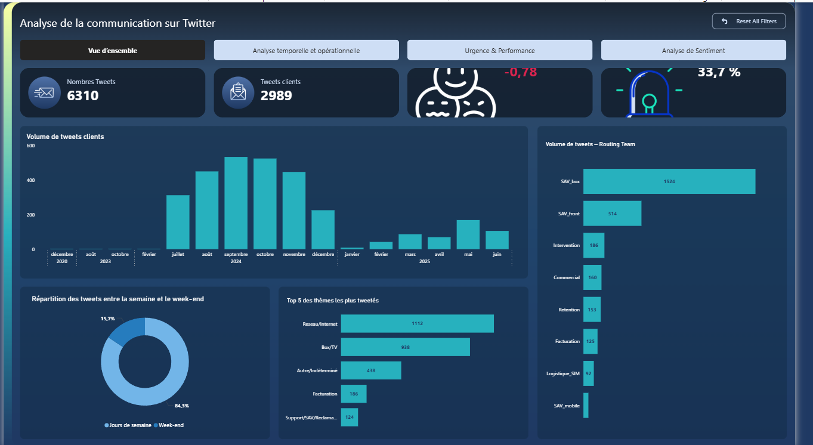

# Tableau de bord Power BI - Memoire SAV

Ce depot presente un tableau de bord Power BI realise dans le cadre de mon memoire de fin d'etude sur l'analyse du service apres-vente.

## Objectif

L'objectif du projet est de suivre et analyser les interactions SAV afin d'aider les equipes support et management a mieux comprendre les volumes, les tendances et les priorites de traitement.

## Contenu du depot

- `memoire-sav-dashboard-power-bi.pbix` : rapport Power BI principal.
- `image_powerbi/` : captures d'ecran du tableau de bord.

## Apercu du tableau de bord

### Vue globale

### Analyse de sentiment

### Analyse temporelle et operationnelle

### Urgence et performance

## Competences mises en avant

- Creation d'un tableau de bord Power BI.
- Preparation et transformation des donnees avec Power Query.
- Modelisation des donnees.
- Creation de KPI et mesures DAX.
- Visualisation et analyse des donnees SAV.
- Restitution d'indicateurs pour le pilotage metier.

## Contexte

Ce projet est issu d'un travail de memoire de fin d'etude autour de l'analyse de donnees SAV. Les donnees publiees dans ce depot doivent rester fictives, anonymisees ou non sensibles.

## Utilisation

Pour consulter le tableau de bord, telecharger le fichier `.pbix` puis l'ouvrir avec Power BI Desktop.
